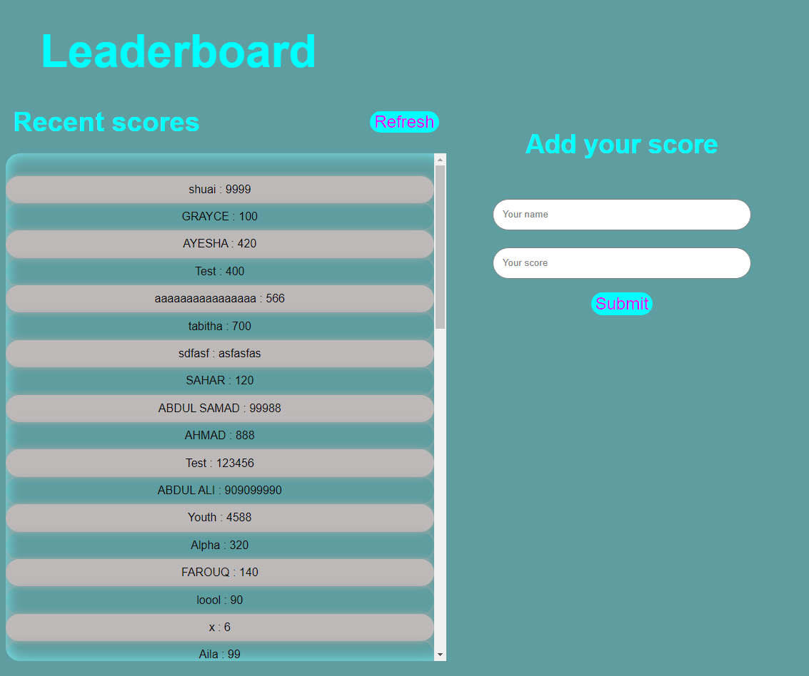

<!--
Hey, thanks for using the awesome-readme-template template.
If you have any enhancements, then fork this project and create a pull request
or just open an issue with the label "enhancement".

Don't forget to give this project a star for additional support ;)
Maybe you can mention me or this repo in the acknowledgements too
-->
<div align="center">

  
  <h1>README for our Project</h1>

<!-- Badges -->
<p>
  <a href="https://github.com/ABDULALI3468/Leader-board-project-using-API-s/graphs/contributors">
    
  </a>
  <a href="">
    
  </a>
  <a href="https://github.com/ABDULALI3468/Leader-board-project-using-API-s/network/members">
    
  </a>
  <a href="https://github.com/ABDULALI3468/Leader-board-project-using-API-s/stargazers">
    
  </a>
  <a href="https://github.com/ABDULALI3468/Leader-board-project-using-API-s/issues/">
    
  </a>
  <a href="https://github.com/ABDULALI3468/Leader-board-project-using-API-s/blob/master/LICENSE">
    
  </a>
</p>

<h4>
    <a href="https://abdulali3468.github.io/Leader-board-project-using-API-s/">View Demo</a>
  <span> · </span>
    <a href="https://github.com/ABDULALI3468/Leader-board-project-using-API-s/issues/">Report Bug</a>
  <span> · </span>
    <a href="https://github.com/ABDULALI3468/Leader-board-project-using-API-s/issues/">Request Feature</a>
  </h4>
</div>

<br />

<!-- Table of Contents -->
# Table of Contents

- [About the Project](#star2-about-the-project)
  * [Screenshots](#camera-screenshots)
  * [Tech Stack](#space_invader-tech-stack)
  * [Features](#dart-features)
- [Getting Started](#toolbox-getting-started)
  * [Prerequisites](#bangbang-prerequisites)
  * [Run Locally](#running-run-locally)
  * [Deployment](#triangular_flag_on_post-deployment)
- [Usage](#eyes-usage)
- [Contributing](#wave-contributing)
- [License](#warning-license)
- [Contact](#handshake-contact)
- [Acknowledgements](#gem-acknowledgements)


<!-- About the Project -->
## :star2: About the Project


<!-- Screenshots -->
### :camera: Screenshots

<div align="center" >
  
</div>


<!-- TechStack -->
### :space_invader: Tech Stack

<details>
  <summary>Client</summary>
  <ul>
    <li><a href="#space_invader-tech-stack">Html</a></li>
    <li><a href="#space_invader-tech-stack">CSS</a></li>
    <li><a href="#space_invader-tech-stack">JavaScript</a></li>
  </ul>
</details>

<details>
  <summary>API</summary>
  <ul>
    <li><a href="https://www.notion.so/microverse/Leaderboard-API-service-24c0c3c116974ac49488d4eb0267ade3">Leaderboard API service</a></li>
  </ul>
</details>

<details>
  <summary>Bundler</summary>
  <ul>
    <li><a href="https://webpack.js.org/guides/getting-started/">Webpack</a></li>
  </ul>
</details>

<details>
<summary>Deployment</summary>
  <ul>
    <li><a href="https://abdulali3468.github.io/Leader-board-project-using-API-s/">Github Pages</a></li>
  </ul>
</details>

<!-- Features -->
### :dart: Features

- Adding Scores
- Scores Competetion etc

<!-- Getting Started -->
## 	:toolbox: Getting Started

<!-- Prerequisites -->
### :bangbang: Prerequisites

This project uses Npm as package manager

```bash
 npm install --global npm
```

<!-- Run Locally -->
### :running: Run Locally

Clone the project

```bash
  git clone https://github.com/ABDULALI3468/Leader-board-project-using-API-s.git
```

Go to the project directory

```bash
  cd Leader-board-project-using-API-s
```

Install dependencies

```bash
  npm install
```

Start the server

```bash
  npm start
```


<!-- Deployment -->
### :triangular_flag_on_post: Deployment

Production

```bash
  npm run build
```


<!-- Usage -->
## :eyes: Usage

How this App works is like when you run the app you will see the screen with all the latest Scores. Peoples can add their
scores to compete with other people! and see who is currently winning the race!


<!-- Contributing -->
## :wave: Contributing

<a href="https://github.com/ABDULALI3468/Leader-board-project-using-API-s/graphs/contributors">
  
</a>

Contributions, issues, and feature requests are welcome!

Feel free to check the [issues page](https://github.com/ABDULALI3468/Leader-board-project-using-API-s/issues).

<!-- License -->
## :warning: License

See [LICENSE](./LICENSE) for more information.


<!-- Contact -->
## :handshake: Contact

## Authors

👤 **ABDUL ALI (TEAM LEADER) **

> * This is My **GitHub**: 
> * This is My **Linkedin**: [](https://www.linkedin.com/in/abdul-ali-5400bb216/)&nbsp;
> * This is My **Twitter**: [](https://twitter.com/mrabdul_ali)&nbsp;


<!-- Acknowledgments -->
## :gem: Acknowledgements

Use this section to mention useful resources and libraries that you have used in your projects.
 - [Leaderboard API service](https://www.notion.so/microverse/Leaderboard-API-service-24c0c3c116974ac49488d4eb0267ade3)
 - [Shields.io](https://shields.io/)
 - [Awesome README](https://github.com/matiassingers/awesome-readme)
 - [Emoji Cheat Sheet](https://github.com/ikatyang/emoji-cheat-sheet/blob/master/README.md#travel--places)
 - [Readme Template](https://github.com/othneildrew/Best-README-Template)
